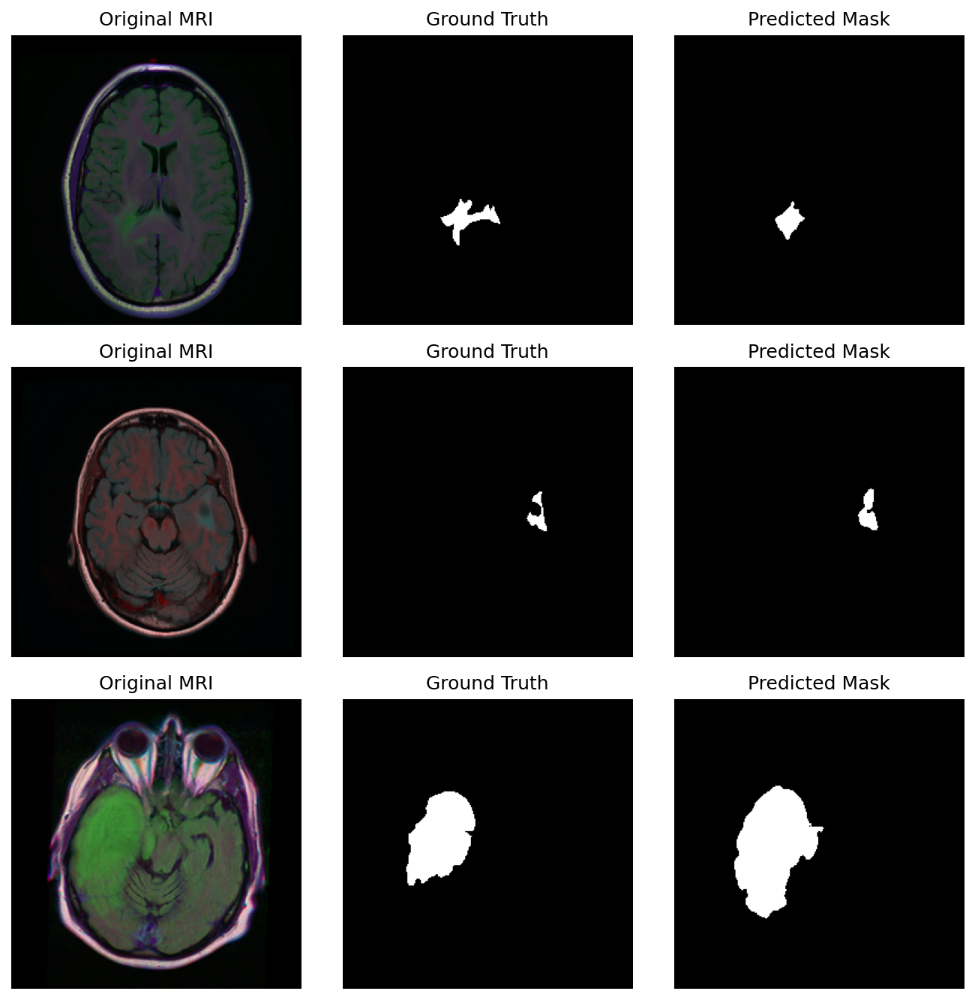
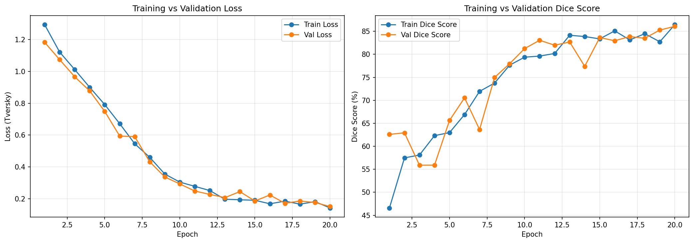

# 🧠 Brain MRI Tumor Segmentation using U-Net

A deep learning project that performs **pixel-level segmentation** of brain tumors from MRI scans using a U-Net convolutional neural network, trained with a **Tversky Loss** function to handle severe class imbalance.

🔗 **[Try the live demo here](https://brain-tumor-segmentation-app-cdt8nfptsgzz8a2wymnf3y.streamlit.app/)** — upload an MRI scan and see the model predict the tumor region in real time.

---

## 📸 Results Preview



*Left to right: Original MRI scan → Ground Truth tumor mask → Model's predicted mask*

---

## 📌 Problem Statement

Manually identifying and outlining tumor regions in MRI scans is time-consuming and requires expert radiologists. This project automates that process using **semantic segmentation** — classifying every single pixel in an MRI image as either "tumor" or "background," producing a pixel-accurate map of the tumor region.

**Task type:** Binary semantic segmentation
**Input:** MRI brain scan (RGB image)
**Output:** Binary mask highlighting the tumor region

---

## 📊 Dataset

- **Source:** Brain MRI Segmentation dataset (Kaggle)
- **Content:** MRI scans paired with expert-annotated binary tumor masks
- **Split:** Train / Validation / Test
- **Challenge:** Significant **class imbalance** — tumor pixels make up a small fraction of each image compared to background, which pushes naive models toward under-predicting tumor regions

---

## 🏗️ Approach & Architecture

### Why U-Net?
U-Net is the standard architecture for biomedical image segmentation. Its **encoder-decoder structure with skip connections** allows it to:
- Capture *what* is in the image (via the encoder, which downsamples and extracts features)
- Recover *where* it is, pixel-by-pixel (via the decoder, which upsamples back to full resolution)
- Preserve fine spatial detail using **skip connections** that pass encoder feature maps directly to the decoder, preventing loss of boundary detail during downsampling

**Model size:** ~31 million trainable parameters (~124 MB checkpoint)

### Loss Function: Tversky Loss
Standard losses (like plain Dice or Binary Cross-Entropy) tend to under-predict small tumor regions due to class imbalance. **Tversky Loss** was used instead because it lets false negatives (missed tumor pixels) be penalized more heavily than false positives — critical in a medical context, where missing a tumor is far more costly than a slightly over-drawn boundary.

### Training Configuration
| Setting | Value |
|---|---|
| Epochs | 20 |
| Loss Function | Tversky Loss |
| Best model selection | Saved checkpoint whenever validation loss improved |
| Hardware | Kaggle free-tier GPU |

---

## 📈 Training Performance



- Training and validation loss decreased smoothly together and plateaued around epoch 15, indicating the model converged without overfitting.
- Training and validation Dice scores tracked closely throughout (final epoch: **86.45%** train vs **86.07%** val), confirming the model generalizes well to unseen data rather than memorizing the training set.

---

## ✅ Final Results

| Metric | Score |
|---|---|
| **Test Dice Score** | **84.65%** |
| Test Loss (Tversky) | 0.1448 |

> **Dice Score** measures the overlap between the predicted mask and the ground truth mask (1.0 = perfect overlap, 0.0 = no overlap). A score in the 80–90% range is considered a strong result for medical image segmentation, especially given limited compute and training time.

**Known limitation:** The model performs very well on clearly visible tumors but can miss very small or low-contrast lesions — a direct consequence of class imbalance in the dataset. This is a common, well-documented challenge in medical segmentation and a natural area for future improvement (see below).

---

## 🧠 Key Learnings & Challenges

- **Class imbalance is the central challenge in medical segmentation.** Since tumor pixels are a small minority of each image, using a loss function that reweights false negatives (Tversky Loss) was essential to prevent the model from defaulting to "predict background everywhere."
- **Validation curves are the real judge of a model, not training accuracy alone.** Watching train vs. validation metrics stay close together was the key signal that confirmed the model was generalizing rather than overfitting.
- **Reproducibility matters in cloud notebooks.** Working across multiple saved notebook versions (Kaggle) surfaced a real debugging lesson: always verify which checkpoint/version is actually being loaded before trusting a "broken" result — several early debugging sessions were actually version-mismatch issues, not model issues.
- **Average metrics hide per-sample variance.** An overall 84.65% Dice Score doesn't mean uniform performance — visual inspection of individual predictions was necessary to discover the small-tumor failure case.

### 🔮 Future Improvements
- Data augmentation to increase effective training data and improve generalization on small tumors
- Tuning the Tversky Loss alpha/beta weights further to push recall higher on small lesions
- Training for more epochs with a learning rate scheduler
- Trying a deeper/pretrained encoder backbone (e.g., ResNet-based U-Net)

---

## 🛠️ Tech Stack
- **Python**, **PyTorch** (model, training loop)
- **NumPy**, **Matplotlib** (data handling, visualization)
- **Kaggle Notebooks** (GPU training environment)

---

## 🚀 How to Run

> 💡 **Fastest way to try it:** just use the [live demo](https://brain-tumor-segmentation-app-cdt8nfptsgzz8a2wymnf3y.streamlit.app/) — no setup needed. The steps below are only for running it locally.

```bash
# 1. Clone the repository
git clone https://github.com/<your-username>/<your-repo-name>.git
cd <your-repo-name>

# 2. Install dependencies
pip install torch torchvision numpy matplotlib

# 3. Run the notebook / script
# Open the notebook in Jupyter/Kaggle/Colab and run all cells,
# or run the training script directly if provided as .py
```

**Pretrained model:** The trained checkpoint (`best_unet_tversky.pth`) is included / linked in this repo — load it directly to run inference without retraining.

---

## 📁 Project Structure

```
├── notebooks/
│   └── unet_segmentation.ipynb     # Full training + evaluation pipeline
├── best_unet_tversky.pth           # Trained model weights
├── training_curves.png             # Loss/Dice score over epochs
├── best_predictions_collage.png    # Sample predictions vs ground truth
└── README.md
```

---

## 📬 Contact
Feel free to reach out with questions or feedback about this project.